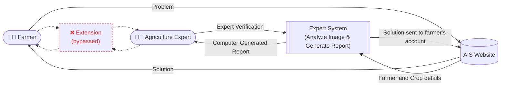

# AXPERT-Mini — Agriculture Expert System (VB.NET)

A VB.NET WinForms desktop app that demonstrates the "integrated
information system to facilitate farmers' workflow: a farmer submits a leaf
photo, an automated expert system processes and analyzes it, produces a
report, an agriculture expert verifies it, and the solution is sent back to
the farmer — replacing the slow, unreliable traditional extension-worker
loop.

## Project flow

The diagram below is the design this app implements: the farmer and the
agriculture expert no longer rely on the slow, unreliable traditional
extension worker (crossed out) — the AIS Website and Expert System sit
between them instead. GitHub renders this automatically since it's a
Mermaid diagram.



**How to read it:**
1. The farmer reports a **Problem** to the AIS Website (with crop details).
2. The website forwards the farmer & crop details to the Expert System.
3. The Expert System **analyzes the image** and **generates a report**.
4. The report goes to an **Agriculture Expert** for **verification**.
5. Once verified, the **solution is sent back** through the website to the
   farmer's account.
6. The dashed, crossed-out path through **Extension** is the traditional
   route this system replaces — slower and dependent on an intermediary
   who may not always be reachable or reliable.

## How it maps to the original design

| Original flow                                   | This app                                             |
|--------------------------------------------------|-------------------------------------------------------|
| Farmer → Problem → AIS Website                    | Username + crop selection + image upload              |
| AIS Website → Farmer & Crop details → Expert System | "Analyze Image" pipeline                             |
| Expert System: Analyze Image and Generate Report  | Grayscale → Sobel edge detection → binarization → emboss filter → lesion-area % → rule-based diagnosis |
| Expert System → Computer Generated Report → Agriculture Expert | "Generate Report" + "Expert Verified" checkbox   |
| Agriculture Expert → Expert Verification → AIS Website | Checkbox gate before saving/sending               |
| AIS Website → Solution sent to farmer's account   | "Send Solution to Farmer" (saves report + images to `Reports/`) |

Supported crops: **Rice**, **Wheat**, **Sugarcane** (matching the thesis'
ring spot / yellow spot / eye spot sugarcane diseases, plus common rice and
wheat diseases).

## Image processing pipeline

Implemented from scratch on top of `System.Drawing`, mirroring the "HIS
Algorithm" / "Detection System" figures from the source thesis:

1. **Grayscale** — luminosity conversion (`0.299R + 0.587G + 0.114B`).
2. **Sobel edge detection** — 3x3 Gx/Gy convolution, gradient magnitude.
3. **Binarization** — fixed threshold (default 110) on the grayscale image.
4. **Emboss filter** — 3x3 emboss kernel with a 128 offset.
5. **Lesion-area %** — percentage of black pixels in the binarized image,
   used as the input to a small per-crop rule base that returns a
   disease name + description.

> This heuristic is intentionally simple so the whole thing fits in one
> file and runs anywhere .NET runs. For real diagnostic accuracy, swap
> `btnDetect_Click`'s rule lookup for a trained image classifier (e.g. a
> CNN exported to ONNX and scored with `Microsoft.ML.OnnxRuntime`).

## Project structure

```
AgriExpertSystem.sln
AgriExpertSystem/
  AgriExpertSystem.vbproj
  Program.vb        ' application entry point
  Form1.vb           ' UI + image processing + rule-based diagnosis
README.md
.gitignore
```

## Requirements

- Windows 10/11
- Visual Studio 2022 (or later) with the **.NET desktop development**
  workload, or the .NET 6 SDK with `dotnet build` from a command line.

## Build & run

```
git clone <this-repo-url>
cd AgriExpertSystem
dotnet build
dotnet run --project AgriExpertSystem
```

or simply open `AgriExpertSystem.sln` in Visual Studio and press **F5**.

## Usage

1. Enter the farmer's username and pick a crop (Rice / Wheat / Sugarcane).
2. Click **Upload Leaf Image** and choose a `.jpg`/`.png`/`.bmp` photo of
   the leaf.
3. Click **Analyze Image** to run the grayscale → edge → binarize → emboss
   pipeline; all four stages are shown alongside the original.
4. Click **Identify Disease** to get a diagnosis and description from the
   rule base.
5. Tick **Agriculture Expert has verified this diagnosis** once a real
   expert has reviewed it (optional but recommended).
6. Click **Generate Report** to build the report text, then **Send
   Solution to Farmer** to save the report and processed images under
   `Reports/` (acting as the farmer's account / AIS website in this demo).

## License

MIT — do whatever you like with it, attribution appreciated.
"# Crops-Disease-Detection-System-BSCS-" 
